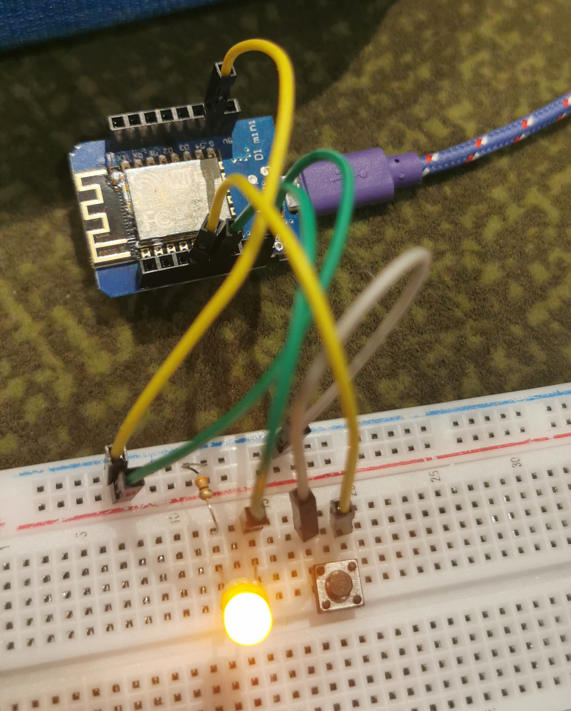

Google sheet: https://docs.google.com/spreadsheets/d/1mrhyfECA6saCIZJXvdgQOEQV6qnPdjrQCfG82YFpArw/edit#gid=0

# Low level buses
## Simple on/off power
 * in early electronic systems for basic power distribution, evolved to support various applications over time
 *  for short-distance power distribution within confined spaces
 *  simple on/off signaling system, no complex data transfer rates
 *  basic wiring arrangement involving conductors, switches, and connectors
   * straightforward, cost-effective implementation
## Analog pin measuring
 * integral to electronic systems since the early days of sensing and measurement, evolved with the growing demand of nuanced, continuous data representation
 * adaptable to both short- and moderate-distance scenarios
 * well-suited for applications where real-time variations need to be captured
 * involves dedicated analog pins that read a spectrum of voltage values
   * wiring configurations tailored for flexibility, allowing for precise signal transmission
## One digital pin measuring
 * efficient solution in early electronic systems
 * adaptable to various applications with flexible spatial requirements
 * suited for short-range communication
 * processes discrete signals with rapid transitions between binary states
 * involves a singular digital pin, streamlining wiring configurations and minimizing complexity
## RS232
 * developed in the 1960s by the Electronic Industries Association (EIA)
   * marked a significant milestone in serial communication standards
 * maximum lengths: 15m
 * early implementations supported lower data rates, commonly around 20kbps
   * over time increased speed capabilities, later versions supporting data rates up to 1Mbps
 * simple wiring with a minimum of three conductors: transmit (TX), receive (RX), and ground
 * asynchronous communication with start and stop bits enhances reliability
## RS485
* introduced in the 1980s as an enhancement to RS-232
  * developed by the EIA for robust, long-distance, and multi-point communication
* up to 1200m
  * or more, depending on baud rate and cable characteristics
* data rates typically from 100bps to 10Mbps
*  2 twisted-pair wires for data transmission, sometimes additional wires for power or other purposes
* multi-point / multi-drop configuration
  * allows multiple devices to be connected on the same bus
* differential signaling
  * helps in reducing susceptibility to electromagnetic interference and noise
* half-duplex communication
  * data can be transmitted in both directions, but not simultaneously
## I2C (Inter-Integrated Circuit)
* synchronous, multi-master, multi-slave, packet-switched, single-ended, serial communication bus
* developed by Philips (now NXP Semiconductors) in the early 1980s
* short-distance communication within electronic devices
  * keeping the bus length under 1 meter is advisable
* supports varying data rates
  * common speeds ranging from 100 kbps (standard mode) to 3.4 Mbps (high-speed mode)
* two-wire bus: Serial Data (SDA) and Serial Clock (SCL)
## SPI (Serial Peripheral Interface)
* developed to facilitate communication between microcontrollers and peripheral devices
* primarily for short-distance communication within a single electronic device
  *  typically for on-board communication between devices
*  high-speed data transfer
  *  from a few hundred kbps to multiple Mbps (depending on devices)
*  four-wire bus
  *  Master Out Slave In (MOSI)
  *  Master In Slave Out (MISO)
  *  Serial Clock (SCK)
  *  Slave Select (SS) or Chip Select (CS)
*  full-duplex communication
## Onewire
*  developed by Dallas Semiconductor (now Maxim Integrated) in the 1990s
*  engineered for simplicity and the minimization of wiring in low-speed, short-distance communication
*  primarily for short-distance communication within small-scale electronic systems
*  efficient in reducing the number of wires required
*  low speed, typically from 15 bps to 100 kbps
*  single wire for communication
  *  plus ground in some cases
*  devices uniquely addressed, allowing multiple devices to share the same communication line

# Getting to know Arduino IDE and the ESP8266 or ESP32.
  * Started the blink task thinking we needed to use eso32, wasted way too much time on that
  * Toggle Led with local button:

